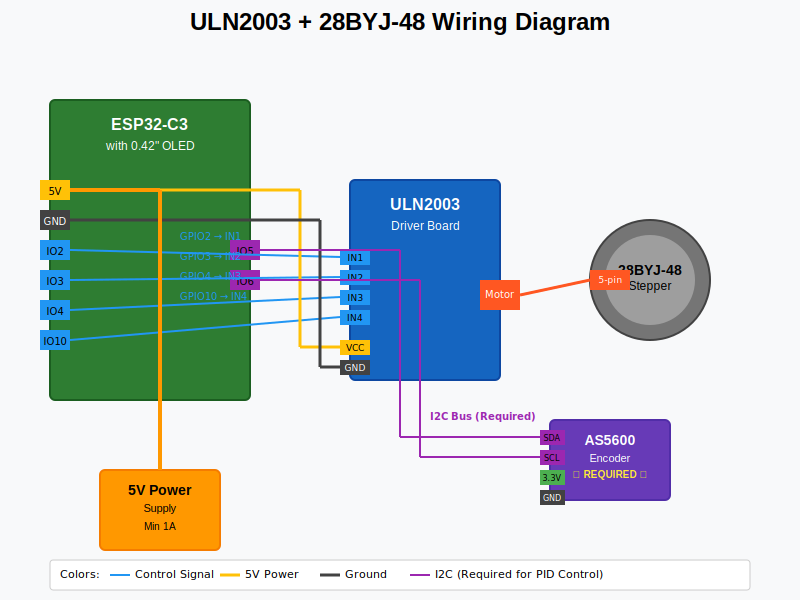

# ULN2003 + 28BYJ-48 Assembly Guide

This guide covers assembling the budget-friendly configuration using the ULN2003 driver with 28BYJ-48 stepper motor.

## Prerequisites

Before starting, ensure you have:
- ✅ Read the [Configuration Options](configuration-options.md) guide
- ✅ Gathered all required components
- ✅ Basic soldering skills
- ✅ Multimeter for testing

## Wiring Diagram Reference



## Step-by-Step Assembly

### Step 1: Prepare the ESP32-C3 Board

1. **Inspect the board** for any obvious damage
2. **Test basic functionality**:
   ```bash
   # Connect via USB and verify in device manager/terminal
   # Board should enumerate as USB device
   ```
3. **Note pin locations** - Compare with your specific board layout

!!! warning "Pin Compatibility"
    Different ESP32-C3 boards may have different pin layouts. Verify your board matches the expected GPIO assignments.

### Step 2: Prepare the ULN2003 Driver

1. **Inspect the ULN2003 board**:
   - Check for cold solder joints
   - Verify all components are properly seated
   - Look for the LED indicators (A, B, C, D)

2. **Test the driver** (optional but recommended):
   - Connect 5V and GND
   - Briefly touch IN1-IN4 to 5V - corresponding LEDs should light

### Step 3: Motor Driver Connections

Connect the ESP32-C3 to ULN2003 following this pinout:

| ESP32-C3 Pin | ULN2003 Pin | Wire Color | Function |
|--------------|-------------|------------|----------|
| **GPIO2** | IN1 | Blue | Motor phase A |
| **GPIO3** | IN2 | Green | Motor phase B |
| **GPIO4** | IN3 | Yellow | Motor phase C |
| **GPIO10** | IN4 | Orange | Motor phase D |
| **5V** | VCC | Red | Power supply |
| **GND** | GND | Black | Ground |

!!! tip "Wiring Tips"
    - Use different colored wires for easy identification
    - Keep control wires away from power wires
    - Use solid core wire for breadboard connections
    - Use stranded wire for final assembly

### Step 4: Motor Connection

1. **Connect the 28BYJ-48 motor**:
   - The motor comes with a 5-pin JST connector
   - Connect directly to the ULN2003 motor output
   - Ensure connector is fully seated

2. **Verify motor wiring**:
   - The wire colors should match (usually Red center, then Blue, Pink, Yellow, Orange)
   - If colors don't match, refer to your motor's datasheet

### Step 5: Display Connection (I2C)

Connect the 0.42" OLED display:

| ESP32-C3 Pin | OLED Pin | Function |
|--------------|----------|----------|
| **GPIO5** | SDA | I2C Data |
| **GPIO6** | SCL | I2C Clock |
| **3.3V** | VCC | Power (3.3V only!) |
| **GND** | GND | Ground |

!!! danger "Voltage Warning"
    The OLED display requires **3.3V**, not 5V. Connecting 5V will damage the display permanently.

### Step 6: Encoder Connection (Optional)

If using the AS5600 magnetic encoder:

| ESP32-C3 Pin | AS5600 Pin | Function |
|--------------|------------|----------|
| **GPIO5** | SDA | I2C Data (shared with OLED) |
| **GPIO6** | SCL | I2C Clock (shared with OLED) |
| **3.3V** | VCC | Power (3.3V only!) |
| **GND** | GND | Ground |

**Magnet placement**:
- Position the diametric magnet 0.5-3mm above the AS5600 chip
- Ensure the magnet rotates with the filter wheel
- Center the magnet over the chip for best accuracy

### Step 7: Power Supply Options

#### Option A: USB Power (Simple)
- Power everything through the ESP32-C3's USB connection
- **Limitation**: May not provide enough current for continuous operation
- **Best for**: Testing and light-duty use

#### Option B: External 5V Supply (Recommended)
- Use a 5V/2A wall adapter or bench supply
- Connect to ESP32-C3's VIN pin and ULN2003's VCC
- **Best for**: Reliable operation and continuous use

### Step 8: Initial Testing

1. **Visual inspection**:
   - Check all connections against the diagram
   - Ensure no short circuits
   - Verify proper wire routing

2. **Power-on test**:
   ```bash
   # Connect power and verify:
   # - ESP32-C3 LED indicators
   # - OLED display shows content
   # - No smoke or unusual heat
   ```

3. **Basic functionality test**:
   ```bash
   # Upload firmware and test basic commands:
   #GP          # Should return current position
   #STATUS      # Should show system status
   #MP2         # Should move motor (if calibrated)
   ```

### Step 9: Mechanical Assembly

1. **Mount the motor**:
   - Secure the 28BYJ-48 to your filter wheel assembly
   - Ensure proper alignment with the filter wheel axis
   - Use flexible coupling if needed to prevent binding

2. **Mount the electronics**:
   - Install ESP32-C3 and ULN2003 in enclosure
   - Route wires cleanly to avoid interference
   - Ensure adequate ventilation

3. **Install the encoder** (if used):
   - Mount AS5600 board so the magnet passes over the sensor
   - Verify 0.5-3mm air gap
   - Test rotation through full range

### Step 10: Software Configuration

1. **Configure the firmware**:
   ```cpp
   // In src/config.h, ensure this line is uncommented:
   #define MOTOR_DRIVER_ULN2003

   // Verify pin assignments match your wiring:
   #define MOTOR_PIN1 2    // Connected to ULN2003 IN1
   #define MOTOR_PIN2 3    // Connected to ULN2003 IN2
   #define MOTOR_PIN3 4    // Connected to ULN2003 IN3
   #define MOTOR_PIN4 10   // Connected to ULN2003 IN4
   ```

2. **Build and upload**:
   ```bash
   pio run -t upload
   ```

3. **Initial calibration**:
   ```bash
   # Connect to serial monitor (115200 baud)
   #CAL         # Calibrate current position as home
   #MP2         # Test movement to position 2
   #GP          # Verify position
   ```

## Troubleshooting

### Motor doesn't move
- **Check power supply** - ULN2003 needs adequate 5V current
- **Verify wiring** - Ensure all IN1-IN4 connections are correct
- **Test driver** - LEDs on ULN2003 should light during movement
- **Check motor** - Verify motor connector is fully seated

### Erratic movement
- **Loose connections** - Check all wire connections
- **Power supply noise** - Use decoupling capacitors
- **Interference** - Route control wires away from power wires

### Display issues
- **Blank display** - Check 3.3V power and I2C connections
- **Partial display** - Verify I2C address (usually 0x3C)
- **No response** - Ensure SDA/SCL aren't swapped

### Encoder problems
- **No angle reading** - Check magnet position and 3.3V power
- **Erratic readings** - Verify magnet distance (0.5-3mm)
- **I2C conflicts** - Ensure AS5600 and OLED have different addresses

## Performance Optimization

### Motor Tuning
```cpp
// In src/config.h, adjust these values:
#define MOTOR_SPEED 300.0           // Steps per second
#define MAX_MOTOR_SPEED 500.0       // Maximum speed
#define MOTOR_ACCELERATION 200.0     // Acceleration
```

### Movement Optimization
- **Lower speeds** reduce noise and improve reliability
- **Higher acceleration** provides faster movements
- **Unidirectional mode** prevents backlash issues

## Next Steps

Once assembly is complete:

1. **Initial Setup** - Configure filter names and positions using serial commands
2. **Calibration** - Perform precision calibration with `#CAL` and `#REVCAL` commands
3. **ASCOM Integration** - Connect to astronomy software using the serial protocol

## Upgrade Path

This ULN2003 configuration can be easily upgraded to TMC2209 later by:
1. Updating `config.h` to use TMC2209
2. Rewiring according to the [TMC2209 guide](assembly-tmc2209.md)
3. Uploading new firmware - all other components remain the same