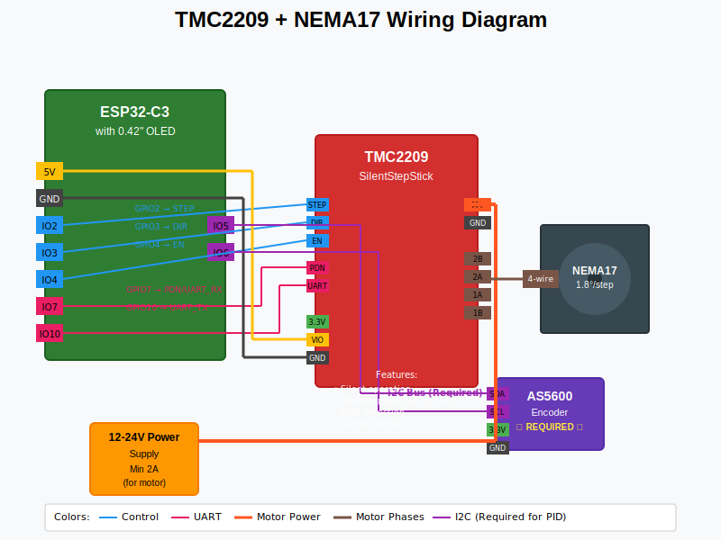

# Configuration Options

The ESP32-C3 Filter Wheel Controller supports two different motor driver configurations, each with its own advantages and use cases.

## Configuration Overview

| Feature | ULN2003 + 28BYJ-48 | TMC2209 + NEMA17 |
|---------|---------------------|-------------------|
| **Cost** | $8-15 | $25-40 |
| **Complexity** | Beginner | Intermediate |
| **Performance** | Good | Excellent |
| **Noise Level** | Moderate | Silent |
| **Precision** | ±0.2° | ±0.05° |
| **Speed** | Up to 500 steps/sec | Up to 5000 steps/sec |
| **Power** | 5V, <300mA | 12-24V, 1-3A |

## Configuration 1: ULN2003 + 28BYJ-48 (Recommended for Beginners)


### Advantages
- **Low cost** - Complete driver + motor kit for under $10
- **Simple wiring** - Direct GPIO connections
- **5V operation** - Can be powered from USB (with limitations)
- **Easy to source** - Available worldwide
- **Proven design** - Widely used in astronomy community

### Disadvantages
- **Moderate noise** - Audible stepping
- **Limited speed** - Maximum ~500 steps/second
- **Less precision** - Basic positioning without microstepping
- **Power consumption** - Motor stays energized

### Best For
- First-time builders
- Budget-conscious projects
- Educational use
- Small/lightweight filter wheels
- Desktop use where noise is acceptable

### Components Required
- ESP32-C3 development board
- ULN2003 driver board
- 28BYJ-48 stepper motor (5V)
- 0.42" OLED display
- AS5600 encoder (**required** for PID control)
- Basic wiring materials

---

## Configuration 2: TMC2209 + NEMA17 (Professional Grade)



### Advantages
- **Silent operation** - Nearly inaudible stepping
- **High precision** - Microstepping up to 256 steps/full step
- **Fast movement** - Up to 5000+ steps/second
- **Advanced features** - Stall detection, current control
- **Professional quality** - Industrial-grade components

### Disadvantages
- **Higher cost** - $25-40 for driver + motor
- **Complex wiring** - Requires UART configuration
- **Higher power** - 12-24V supply needed
- **Advanced setup** - Requires more technical knowledge

### Best For
- Professional observatories
- High-precision applications
- Remote/robotic operation
- Low-noise environments
- Heavy filter wheels requiring more torque

### Components Required
- ESP32-C3 development board
- TMC2209 SilentStepStick
- NEMA17 bipolar stepper motor
- 12-24V power supply (2A minimum)
- 0.42" OLED display
- AS5600 encoder (recommended)
- Professional wiring materials

---

## Choosing Your Configuration

### Choose ULN2003 + 28BYJ-48 if:
- ✅ You're new to electronics
- ✅ Budget is under $50
- ✅ Building a desktop setup
- ✅ Want quick results
- ✅ Noise isn't critical

### Choose TMC2209 + NEMA17 if:
- ✅ You have electronics experience
- ✅ Budget allows $100+
- ✅ Need silent operation
- ✅ Require maximum precision
- ✅ Building permanent observatory setup

---

## Configuration in Code

To select your configuration, edit `src/config.h`:

### For ULN2003 Configuration:
```cpp
// Select motor driver type (uncomment only one)
#define MOTOR_DRIVER_ULN2003    // ULN2003 with 28BYJ-48 stepper
//#define MOTOR_DRIVER_TMC2209    // TMC2209 with NEMA17
```

### For TMC2209 Configuration:
```cpp
// Select motor driver type (uncomment only one)
//#define MOTOR_DRIVER_ULN2003    // ULN2003 with 28BYJ-48 stepper
#define MOTOR_DRIVER_TMC2209      // TMC2209 with NEMA17
```

The system will automatically configure pins, timing, and features based on your selection.

---

## Next Steps

Choose your configuration and proceed to the specific assembly guide:

- **[ULN2003 Assembly Guide](assembly-uln2003.md)** - Step-by-step for beginners
- **[TMC2209 Assembly Guide](assembly-tmc2209.md)** - Professional configuration

Both configurations share the same:
- Firmware (automatically adapts)
- ASCOM driver
- Serial commands
- Display interface
- Optional encoder support