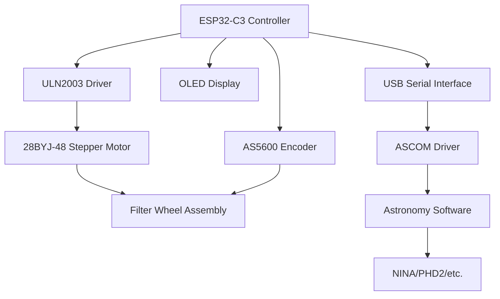

# ESP32-C3 Filter Wheel Controller

A professional, open-source astronomy filter wheel controller built on the ESP32-C3 microcontroller. Features PID-based encoder control, integrated OLED display, and full ASCOM compatibility for seamless integration with popular astronomy software.

## ✨ Key Features

### 🎯 **PID Precision Control (v2.0)**
- **Closed-loop PID controller** with AS5600 magnetic encoder
- **<0.8° positioning accuracy** with automatic error correction
- **Self-correcting** for missed steps and mechanical errors
- **Bidirectional movement** - chooses shortest path automatically
- **Tuned parameters** (Kp=4.5, Ki=0.01, Kd=0.3) optimized for 28BYJ-48

### 🔧 **Flexible Configuration**
- **3-9 filter positions** (expanded from 3-8)
- **Custom filter names** up to 15 characters each
- **Custom angle calibration** for non-uniform filter spacing
- **Runtime direction inversion** for motor and encoder
- **Persistent EEPROM storage** for all settings

### 🔄 **Advanced Motor Control**
- **28BYJ-48 stepper motor** with 2048 steps/revolution
- **Configurable speed, acceleration, and disable delay**
- **Automatic power management** reduces heat and power consumption
- **Direction inversion** without hardware rewiring

### 📟 **Integrated Display**
- **0.42" OLED display** (72x40 visible area)
- **Real-time position and status** information
- **Filter name display** with customizable labels
- **180° rotation support** for flexible mounting

### 🌐 **ASCOM Compatible**
- **Complete ASCOM driver integration**
- **Serial protocol** (115200 baud, USB)
- **NINA, PHD2, and other software** support
- **47+ serial commands** for complete control

## 🚀 Quick Start

### Hardware Requirements

- **ESP32-C3** development board
- **28BYJ-48** stepper motor with ULN2003 driver
- **AS5600** magnetic encoder (required for PID control)
- **0.42" OLED** display (SSD1306, I2C)
- **Filter wheel** assembly
- **USB cable** for programming and communication

### Assembly Guide

Follow the step-by-step [Assembly Guide](getting-started/assembly-uln2003.md) to build your filter wheel controller.

### Setup Process

1. **Assemble Hardware** - Follow the assembly guide
2. **Flash Firmware** - Upload firmware to ESP32-C3 via PlatformIO
3. **Calibrate Encoder** - Use `#CAL` command to set position 1
4. **Configure Filters** - Set filter count and names
5. **Test Movement** - Verify positioning accuracy

## 🎬 Demo Video

<div class="video-wrapper">
  WIP
</div>

## 📋 Specifications

### Hardware Specifications

| Component | Specification |
|-----------|---------------|
| **Microcontroller** | ESP32-C3 (160MHz, 320KB RAM, 4MB Flash) |
| **Display** | 0.42" OLED SSD1306 (72x40 visible, I2C) |
| **Encoder** | AS5600 magnetic (12-bit, 0.088°/count, **required**) |
| **Motor** | 28BYJ-48 unipolar stepper (2048 steps/rev) |
| **Driver** | ULN2003 (5V, <300mA) |
| **Filters** | 3-9 positions (configurable) |
| **Communication** | USB Serial (115200 baud, 8N1) |
| **Positioning Accuracy** | <0.8° with encoder, ±2-5° without |
| **Power** | 5V USB (motor can use external 5-12V) |

## 🛠️ Supported Commands

**47+ serial commands** organized by category:

=== "Essential Operations"
    ```bash
    #GP              # Get current position
    #MP3             # Move to position 3
    #GF              # Get filter count
    #FC5             # Set filter count to 5
    #STATUS          # Get complete system status
    #STOP            # Emergency stop
    ```

=== "Filter Configuration"
    ```bash
    #GN              # Get all filter names
    #SN1:Luminance   # Set filter 1 name
    #SN2:Red         # Set filter 2 name
    ```

=== "Calibration"
    ```bash
    #CAL             # Calibrate encoder offset (position 1 = 0°)
    #SETANG1:0.0     # Set custom angle for position 1
    #SETANG2:68.5    # Set custom angle for position 2
    #GETANG          # Get all custom angles
    #CLEARANG        # Clear custom angles
    ```

=== "Motor Configuration"
    ```bash
    #GMC             # Get motor configuration
    #MS400           # Set motor speed
    #MXS600          # Set max motor speed
    #MA200           # Set motor acceleration
    #MDD1000         # Set motor disable delay
    ```

=== "Direction Inversion"
    ```bash
    #MINV0           # Motor direction normal
    #MINV1           # Motor direction inverted
    #GMINV           # Get motor inversion status
    #ENCINV0         # Encoder direction normal
    #ENCINV1         # Encoder direction inverted
    #GENCINV         # Get encoder inversion status
    ```

**Full Command Reference**: [ASCOM_COMMANDS.md](https://github.com/juanjol/autoFilterWheel/blob/main/ASCOM_COMMANDS.md)

## 🏗️ Architecture Overview



## 📈 Project Status


- ✅ **Current Release** - v2.0.0 with PID control
- 🔄 **Active Development** - Regular updates and improvements
- 📚 **Full Documentation** - Complete command reference and assembly guides

## 🆕 What's New in v2.0.0

### Major Features
- **PID-Based Encoder Control**: Closed-loop feedback for <0.8° accuracy
- **Custom Angle Calibration**: Support for non-uniform filter spacing
- **Direction Inversion**: Runtime motor and encoder direction control
- **Extended Filter Support**: Now supports 3-9 filter positions
- **Simplified Calibration**: One-step `#CAL` command replaces complex wizards

### Technical Improvements
- **Removed 1000+ lines** of obsolete calibration code
- **Automatic Error Correction**: Self-corrects missed steps and mechanical errors
- **Bidirectional Movement**: Chooses shortest path to target
- **Complete EEPROM Persistence**: All settings auto-load at startup

### Breaking Changes from v1.x
- Removed: `REVCAL`, `BLCAL`, and related calibration commands
- Changed: `#CAL` now calibrates encoder offset (simplified)
- Added: Custom angle commands (`SETANG`, `GETANG`, `CLEARANG`)
- Added: Direction inversion commands (`MINV`, `ENCINV`, etc.)

---

*Ready to build your own DIY filter wheel controller? Get started with the [Assembly Guide](getting-started/assembly-uln2003.md)!*