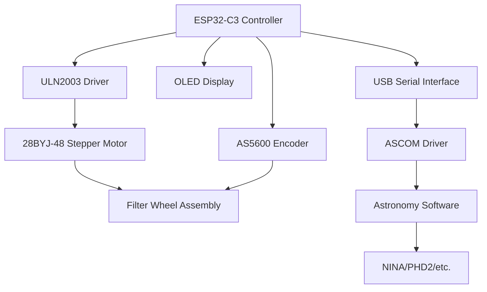

# ESP32-C3 Filter Wheel Controller


A professional, open-source astronomy filter wheel controller built on the ESP32-C3 microcontroller. Features integrated OLED display, stepper motor control, magnetic encoder feedback, and full ASCOM compatibility for seamless integration with popular astronomy software.

## ✨ Key Features

### 🔄 **Advanced Motor Control**
- **28BYJ-48 stepper motor** with precise positioning
- **Configurable speed, acceleration, and direction** settings
- **Backlash compensation** for improved accuracy
- **Automatic power management** to reduce heat and power consumption

### 📟 **Integrated Display**
- **0.42" OLED display** (72x40 visible area)
- Real-time position and status information
- Filter name display with customizable labels
- Movement progress indication

### 🎯 **Precision Positioning**
- **AS5600 magnetic encoder** for position feedback (optional)
- **Revolution calibration** for exact step counting
- **Backlash calibration** for mechanical compensation
- **Multiple positioning modes** (unidirectional/bidirectional)

### 🔧 **Full Configuration Control**
- **3-8 filter positions** configurable via commands
- **Custom filter names** up to 15 characters each
- **Dynamic motor parameters** without firmware recompilation
- **Persistent EEPROM storage** for all settings

### 🌐 **ASCOM Compatible**
- **Complete ASCOM driver integration**
- **Serial protocol** compatible with astronomy software
- **NINA, PHD2, and other software** support
- **115200 baud serial communication**

## 🚀 Quick Start

### Choose Your Configuration

The controller supports two configurations - choose based on your needs and experience:

| Configuration | Best For | Cost | Complexity |
|---------------|----------|------|------------|
| **[ULN2003 + 28BYJ-48](getting-started/assembly-uln2003.md)** | Beginners, Budget builds | ~$25 | Simple |
| **[TMC2209 + NEMA17](getting-started/assembly-tmc2209.md)** | Professional setups | ~$80 | Advanced |

### Assembly Process

1. **[Choose Configuration](getting-started/configuration-options.md)** - Compare options and decide
2. **Hardware Requirements** - Gather required components (see assembly guides)
3. **Assembly Guide** - Follow your configuration-specific guide:
   - **[ULN2003 Assembly](getting-started/assembly-uln2003.md)**
   - **[TMC2209 Assembly](getting-started/assembly-tmc2209.md)**
4. **Firmware Installation** - Flash the ESP32-C3 (documentation coming soon)
5. **First Setup** - Configure your filter wheel (documentation coming soon)

## 🎬 Demo Video

<div class="video-wrapper">
  WIP
</div>

## 📋 Specifications

### Common Components
| Feature | Specification |
|---------|---------------|
| **Microcontroller** | ESP32-C3 (160MHz, WiFi, BLE) |
| **Display** | 0.42" OLED SSD1306 (128x64, I2C) |
| **Encoder** | AS5600 magnetic (12-bit resolution, optional) |
| **Filters** | 3-8 positions (configurable) |
| **Communication** | USB Serial (115200 baud) |

### Motor Configurations

=== "ULN2003 + 28BYJ-48"
    | Feature | Specification |
    |---------|---------------|
    | **Motor** | 28BYJ-48 unipolar stepper |
    | **Steps/Revolution** | 2048 (with internal gearing) |
    | **Max Speed** | ~500 steps/second |
    | **Power** | 5V, <300mA |
    | **Noise Level** | Moderate |
    | **Precision** | ±0.2° |
    | **Cost** | ~$25 total |

=== "TMC2209 + NEMA17"
    | Feature | Specification |
    |---------|---------------|
    | **Motor** | NEMA17 bipolar stepper |
    | **Steps/Revolution** | 3200-51200 (microstepping) |
    | **Max Speed** | >5000 steps/second |
    | **Power** | 12-24V, 1-3A |
    | **Noise Level** | Near silent |
    | **Precision** | ±0.05° |
    | **Cost** | ~$80 total |

## 🛠️ Supported Commands

Over **50 serial commands** for complete control:

=== "Basic Operations"
    ```bash
    #GP        # Get current position
    #MP3       # Move to position 3
    #STATUS    # Get system status
    ```

=== "Configuration"
    ```bash
    #FC5       # Set 5 filters
    #SN1:Luminance  # Set filter name
    #MS1000    # Set motor speed
    ```

=== "Calibration"
    ```bash
    #REVCAL    # Calibrate revolution
    #BLCAL     # Calibrate backlash
    #CAL       # Set home position
    ```

**Command Reference** - Over 50 serial commands for complete control (see CLAUDE.md for full list)

## 🏗️ Architecture Overview



## 📈 Project Status


- ✅ **Stable Release** - v1.0.0 available
- 🔄 **Active Development** - Regular updates and improvements

---

*Ready to build your own DIY filter wheel controller? Get started with the [Configuration Options](getting-started/configuration-options.md)!*