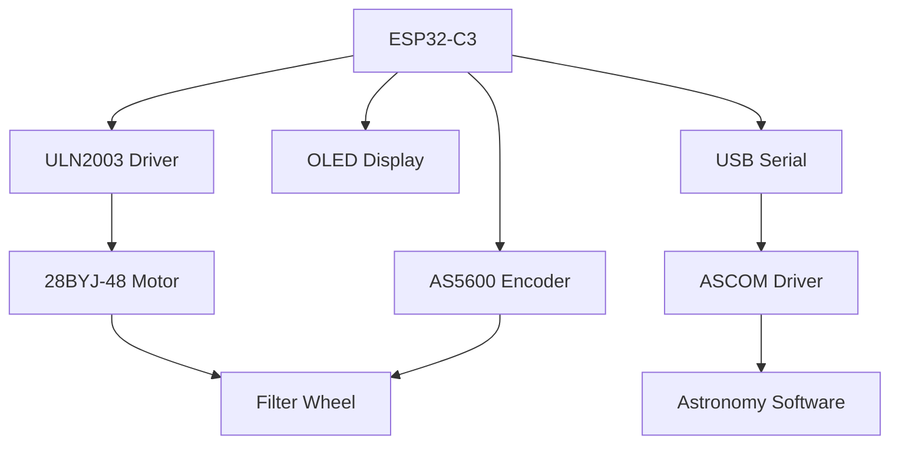

# ESP32-C3 Filter Wheel Controller

Open-source astronomy filter wheel controller based on ESP32-C3 microcontroller. Features PID-based encoder control, OLED display, and ASCOM compatibility.

## Features

### Precision Control
- Closed-loop PID controller with AS5600 magnetic encoder
- Sub-degree positioning accuracy (<0.8°)
- Automatic error correction for missed steps
- Bidirectional movement with shortest path selection

### Configuration
- 3-9 filter positions
- Custom filter names (up to 15 characters)
- Custom angle calibration for non-uniform spacing
- Runtime direction inversion for motor and encoder
- EEPROM storage for all settings

### Motor Control
- 28BYJ-48 stepper motor (2048 steps/revolution)
- Configurable speed, acceleration, and timing
- Automatic power management
- Direction inversion without rewiring

### Display
- 0.42" OLED (72x40 visible area)
- Real-time position and status
- Filter name display with auto-scroll
- 180° rotation support

### Compatibility
- ASCOM driver integration
- Serial protocol (115200 baud, USB)
- 47+ serial commands
- Compatible with NINA, PHD2, and other astronomy software

## Hardware Requirements

- ESP32-C3 development board
- 28BYJ-48 stepper motor with ULN2003 driver
- AS5600 magnetic encoder (required for PID control)
- 0.42" OLED display (SSD1306, I2C)
- Filter wheel assembly
- USB cable for programming and communication

## Quick Start

1. **Assemble Hardware** - Follow the [Assembly Guide](getting-started/assembly-uln2003.md)
2. **Flash Firmware** - Upload firmware to ESP32-C3 via PlatformIO
3. **Calibrate Encoder** - Use `#CAL` command to set position 1
4. **Configure Filters** - Set filter count and names
5. **Test Movement** - Verify positioning accuracy

## Specifications

| Component | Specification |
|-----------|---------------|
| Microcontroller | ESP32-C3 (160MHz, 320KB RAM, 4MB Flash) |
| Display | 0.42" OLED SSD1306 (72x40 visible, I2C) |
| Encoder | AS5600 magnetic (12-bit, 0.088°/count) |
| Motor | 28BYJ-48 unipolar stepper (2048 steps/rev) |
| Driver | ULN2003 (5V, <300mA) |
| Filters | 3-9 positions (configurable) |
| Communication | USB Serial (115200 baud, 8N1) |
| Accuracy | <0.8° with encoder |
| Power | 5V USB (motor can use external 5-12V) |

## Essential Commands

### Basic Operations
```bash
#GP              # Get current position
#MP3             # Move to position 3
#GF              # Get filter count
#FC5             # Set filter count to 5
#STATUS          # Get complete system status
#GETCONFIG       # Get all configuration at once
#STOP            # Emergency stop
```

### Filter Configuration
```bash
#GN              # Get all filter names
#SN1:Luminance   # Set filter 1 name
#SN2:Red Filter  # Set filter 2 name (spaces allowed)
```

### Calibration
```bash
#CAL             # Calibrate encoder offset (position 1 = 0°)
#SETANG1:0.0     # Set custom angle for position 1
#SETANG2:68.5    # Set custom angle for position 2
#GETANG          # Get all custom angles
#CLEARANG        # Clear custom angles
#MEASREV         # Measure full 360° revolution
```

### Motor Configuration
```bash
#GMC             # Get motor configuration
#MS400           # Set motor speed
#MXS600          # Set max motor speed
#MA200           # Set motor acceleration
```

### Display Control
```bash
#DISPMODE0       # Minimal display mode (large number)
#DISPMODE1       # Detailed display mode (3 lines)
#ROTATE0         # Normal orientation
#ROTATE1         # 180° rotation
#BRIGHT128       # Set brightness (0-255)
```

Full command reference: [COMMANDS.md](https://github.com/juanjol/autoFilterWheel/blob/main/COMMANDS.md)

## Architecture


```mermaid
graph TB
    A[ESP32-C3] --> B[ULN2003 Driver]
    B --> C[28BYJ-48 Motor]
    C --> D[Filter Wheel]
    A --> E[AS5600 Encoder]
    E --> D
    A --> F[OLED Display]
    A --> G[USB Serial]
    G --> H[ASCOM Driver]
    H --> I[Astronomy Software]
```

## Wiring Diagram

### ULN2003 Motor Driver
```
ESP32-C3          ULN2003
GPIO4      -----> IN1
GPIO5      -----> IN2
GPIO6      -----> IN3
GPIO7      -----> IN4
5V         -----> VCC
GND        -----> GND

Motor: 5-pin connector
```

### AS5600 Encoder
```
ESP32-C3          AS5600
GPIO8 (SDA)----> SDA
GPIO9 (SCL)----> SCL
3.3V       ----> VCC
GND        ----> GND
```

### OLED Display
```
ESP32-C3          OLED
GPIO8 (SDA)----> SDA
GPIO9 (SCL)----> SCL
3.3V       ----> VCC
GND        ----> GND
```

## Version History

### v3.0.0 (Current)
- Added GETCONFIG command for faster initialization
- Display improvements: auto-scrolling for long filter names
- Fix: minimal display mode now works in both rotations
- Fix: filter names preserve case and support spaces
- Minor performance optimizations

### v2.0.0
- PID-based encoder control for sub-degree accuracy
- Custom angle calibration support
- Runtime direction inversion
- Extended to 3-9 filter positions
- Simplified calibration process
- Removed 1000+ lines of obsolete code

---

Ready to build? Start with the [Hardware Requirements](getting-started/hardware.md)
